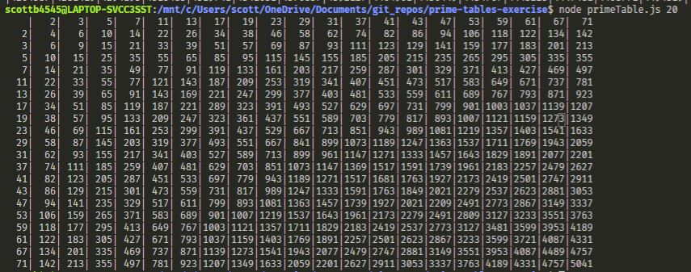

# Prime Tables

This application takes an numeric input (N) and outputs a multiplication table of the first N prime numbers (whole numbers that are only divisible by 1 and itself e.g. 3, 7).

The application is written in JavaScript with testing in Mocha/Chai.

**Example Output** 

**Running The File**

The file is run on the command line using node.

Run `npm install` on the command line to download the dependencies.

To test run the command `npm test`

To run the file itself please navigate on the command line to the directory and run the command `node PrimeTable.js n` (where n is the size of the table you would like e.g. node PrimeTable.js 9 for a 9 x 9 table )

**What I'm Pleased With**

- The modular aspect of having several smaller functions that are easier to test.
- Having several modular functions that could be used separately.
- That the columns on the output are aligned.

**What I Would Do If I Had More Time**

- Add another testing package that would allow me to test the console.logs outputted from the table functions.
- Investigate improving the prime checking algorithm's performance by not evaluating common multiples of already checked numbers e.g. if 89/3 doesn't divide without a remainder then you know that its unnecessary to check 89/9.
- Try to add some sort of formatting on the command line output, so that the first column and row is differentiated.
- Add a graphical front end perhaps using react. This would also make dynamic manipulation of the table possible.

